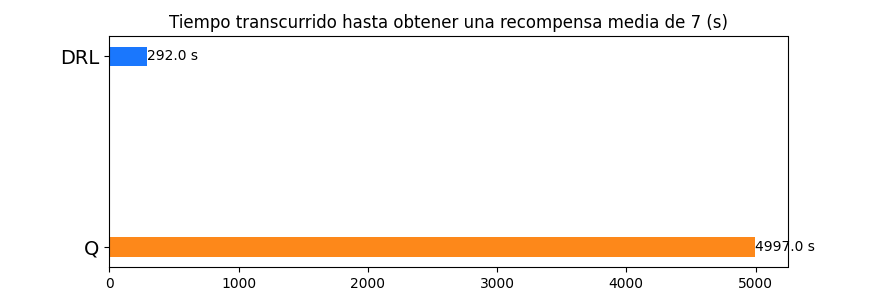
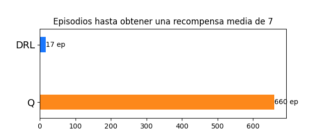
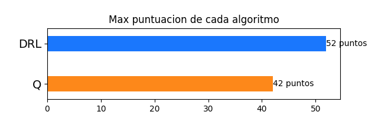
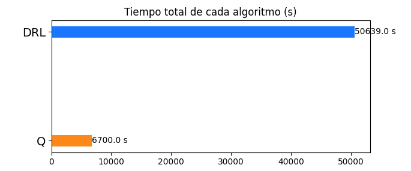
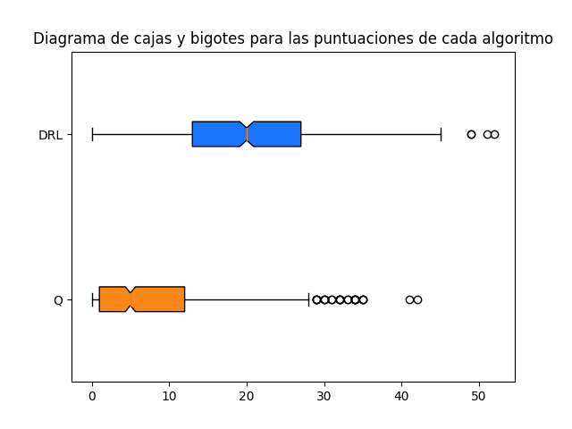

# Introducción

Mediante el presente proyecto se pretende implementar una solución al famoso juego Snake, en el cual nos encontramos en un entorno cuadrado donde aparecen "manzanas" que debemos recolectar para poder hacer crecer de tamaño nuestro personaje, que resulta, como el nombre del juego lo indica, una serpiente cuyo cuerpo se agranda a medida que se van recolectando dichas manzanas. El personaje no debe colisionar con paredes o con su propio cuerpo, ya que esto significa que se vuelva a la puntuación inicial perdiendo todo el progreso

 La premisa del videojuego resulta sencilla, desarrollar un entramado de "if else" puede llegar a resolver el problema y, aunque no demasiado elegante, llegaríamos a una solución razonable. El gran problema de este acercamiento es que nuestro programa nunca podría mejorar sus habilidades mas allá de aquellas con las que fue diseñado en primer lugar, por mas que nuestro programa tropiece una y otra vez con su cuerpo o una pared, este no aprenderá de dichos sucesos, incluso, tendremos el grave problema de que el personaje se comportará exactamente igual ante situaciones similares y por tanto, siempre tendrá los mismos aciertos y errores. Por otro lado, la eficacia del programa depende enteramente de la habilidad del programador en el juego en cuestión, ya que deben definirse reglas de comportamiento para cada una de las situaciones que se puedan llegar a dar en el juego, y si bien en este caso puede no parecer tan extensa, no resulta fácil definir una regla para cada una de las situaciones que se puedan llegar a dar en el juego.
	
A causa de todo lo nombrado anteriormente, decidimos que el problema se debía resolver mediante técnicas de aprendizaje reforzado, ya que estas nos brindan la posibilidad de desplegar un agente dentro del entorno el cual tenga capacidad de generar reglas de comportamiento propias en base a sus experiencias mientras juega, basado principalmente en un sistema de recompensas que el propio entorno provee cada vez que el agente realiza una acción. De esta forma, nuestro programa (ahora denominado agente) puede superar ampliamente las habilidades de quien lo programa dentro del propio juego, ya que con suficiente práctica, podría llegar a generar reglas de comportamiento generales y aplicarlas a cada momento, reglas que incluso aquel que lo programó desconocía.

En las siguientes secciones se explicarán todos aquellos conceptos teóricos utilizados para la formulación de nuestra solución y se explicarán nuestras implementaciones para resolver el problema, así como comparaciones entre los distintos algoritmos subyacentes a cada una de las implementaciones.
# Marco teórico

## Conceptos base

Los siguientes conceptos resultan fundamentales para explicación e implementación de todas las técnicas que se utilizaran para resolver el problema, las cuales serán explicadas en orden, comenzando por los conceptos mas teóricos como lo son los los SDP (Sequential Decision Problems por sus siglas en inglés), MDP (Markov Decision Process por sus siglas en inglés), siguiendo por aquellos conceptos cercanos a la implementacion como son el caso del algoritmo de Q-Learning y la utilización de redes neuronales en lo que se denomina DRL (Deep Reinforcement Learning por sus siglas en inglés).

Uno de los patrones que presentan todos aquellos problemas en los que se requiere de aprendizaje en base a la experiencia es la presencia de un conjunto de acciones que se pueden llegar a tomar, en conjunto con determinados estados en los que se puede llegar a estar según la situación. El desafío resulta de tener que tomar decisiones correctas con respecto a que acción realizar en función del estado en donde nos encontremos y a donde queramos llegar. Esto nos trae inmediatamente a lo que se denomina un SDP, el cual resulta un problema en el cual nuestro personaje (a partir de ahora llamado agente) debe llegar a un estado deseado mediante la realización de un conjunto de acciones ordenadas y elegidas en secuencia sobre un entorno, pero bien ¿Como podemos lograr que nuestro agente tome las decisiones correctas en un entorno? 

En primer lugar tenemos que definir un tipo de entorno para nuestro agente, para el total de los casos tratados en el presente informe se tendrán en cuenta entornos completamente determinísticos, los cuales resultan estáticos y no dependen de ningún tipo de azar, es decir, si al agente le está permitido desplazarse hacia arriba en algún tipo de tablero, este podrá el 100% de los casos sin ningún posible impedimento. Nuestro entorno también será definido siempre como completamente observable, es decir que el agente sabe a todo momento en que estado se encuentra, además de saber las posibles acciones que puede llegar a tomar.

Una vez definido el entorno, podemos retomar nuestra pregunta sobre aprendizaje de nuestro agente. El primer acercamiento que posiblemente se nos ocurra como seres humanos es el de la prueba y error, es decir, si queremos aprender sobre cualquier cosa, debemos intentar tomar acciones y observar los resultados para así poder tomar decisiones sobre que acción ejecutar según el estado en el que nos encontremos, y de esta forma, encontrar la secuencia de acciones que nos lleve a conseguir nuestro objetivo, ya sea llegar a alguna posición en particular o golpear correctamente la pelota en algún deporte.

El principio que rige el aprendizaje reforzado es el denominado MDP (Markov Decision Process), el cual se define teóricamente mediante un conjunto de acciones denominado: ‘a’, el cual representa el conjunto de acciones realizables por nuestro agente dentro del entorno, un conjunto de estados denominado: ‘s’, el cual contiene todos los posibles estados en los que el agente puede llegar a encontrarse según su situación en el entorno, también, se define el modelo de transición que se representa mediante una función P(s,a) = s’, siendo ‘s’ el estado actual del agente y ‘a’ la acción que el agente toma a continuación, devolviendo “ s’ ” que resulta el nuevo estado en el que el agente se encuentra, por último, se definen las recompensas, estas resultan una parte fundamental dentro del aprendizaje del agente, ya que informan al agente que tan “deseable” resulta una acción tomada y que tan “deseable” resulta estar en un estado específico ( capítulo 17 sección 1 de AIMA ).

En base a nuestro MDP, definido generalmente por las propiedades del problema, para llegar  a una solución debemos encontrar lo que se denomina una “Política óptima”, una política representa la forma en la cual el agente se comporta en determinadas situaciones, básicamente actúa como una especie de conciencia que le dice que hacer basado en las probabilidades de obtener una mayor recompensa con sus acciones. Se dice que esta política es óptima, si para cada paso que da el agente  se está tomando una decisión que favorece a la recompensa total obtenida por el agente luego de conseguir el objetivo.

En torno a encontrar la denominada “política óptima” es en lo que trabajan cada uno de los algoritmos de aprendizaje reforzado, para lograr encontrarla, los algoritmos trabajan con un conjunto de conceptos para trabajar su “memoria”, en este caso memoria se refiere a la capacidad del agente de almacenar el conocimiento adquirido durante su experiencia en el entorno para posteriormente utilizarlo a la hora de tomar acciones que maximicen la recompensa. Las recompensas se otorgan al agente en función del problema a resolver, esto se profundizará en las secciones correspondientes a nuestra implementación para resolver el juego de “Snake”, donde se explicará en profundidad como se distribuyen las recompensas para facilitar el aprendizaje del agente en este entorno específico.

Como ya se explicó, la idea del aprendizaje reforzado es la experimentación del agente en el entorno para así entender las reglas del mismo y resolver un problema determinado, el proceso que los algoritmos utilizan para hacer que el agente “experimente” se denomina episodio. Los episodios se refieren, en resumidas cuentas, a una secuencia de acciones que el agente tomó hasta llegar a un estado terminal, es decir, tuvo “éxito” o “fracasó”. Para que pueda entenderse con claridad, si se estuviera entrenando a un agente para encontrar la ruta mas corta hacia un punto dado, uno de los estados terminales estaría dado por haber llegado a la meta y otro por haberse quedado sin tiempo, estos estados finales marcan la terminación de una secuencia de acciones que llevó al agente a un éxito o fracaso.

Para realizar el aprendizaje, el algoritmo evalúa el rendimiento del agente en cada uno de estos episodios. El rendimiento se evalúa mediante la sumatoria de las recompensas obtenidas por el agente a lo largo de la secuencia de acciones que este realizó durante un episodio, así, si el agente tuvo un buen rendimiento en determinado episodio, la suma total de recompensas será mas alta que en aquel en el que no llegó al objetivo o tomó un camino mas largo (en caso de un agente siendo entrenado para encontrar el camino mas corto de un punto a otro)

Cuando nuestro agente se encuentra en una posición determinada, puede hacer uso de su conocimiento del entorno para calcular mediante probabilidades, cual será el camino que mayor recompensa le brindará, esta estimación en conjunto con el conocimiento adquirido durante los episodios se puede realizar de dos maneras: (también llamadas funciones de utilidad, página 649 AIMA)

1)  Recompensa aditiva: R([s0,s1,s2,…]) = R(s0)  + R(S1) + …

La función R representa la recompensa total estimada a la hora de tomar un conjunto de acciones en el futuro (o en el pasado en caso de estar calculando la recompensa de un episodio) y [s0,s1,s2,…] representan los estados en los que el agente va a encontrarse luego de tomar determinadas acciones.

Esta función resulta ser “inocente”, ya que no toma en cuenta la cercanía de las acciones al momento en el tiempo donde se encuentra el agente, es decir, la recompensa aporta lo mismo ya sea que se tome dentro de 10 unidades de tiempo o en la siguiente, lo que puede ser perjudicial y tomar una decisión inmediata demasiado negativa en la cercanía de tiempo, siendo que el agente se está arriesgando a una estimación realizada sobre una recompensa a largo plazo que puede o no ser correcta. Una analogía podría ser el mundo de las finanzas, si se estima que el bitcoin a 10 años va a costar 100 veces mas, pero hoy en día resulta una pésima inversión, corremos el riesgo de que nuestra predicción sea errónea y perdamos mucho dinero.

2) Recompensa descontada: R([s0,s1,s2,…]) = R(s0)  + a*R(s1) + a^2*R(s2)

Para el cálculo de esta función se introduce un valor numérico entre 0 y 1 llamado factor de descuento, el cual representa la preferencia que puede tendrá el agente por la recompensa inmediata por sobre la recompensa a largo plazo, evitando así, el problema definido anteriormente.

## Algoritmos

Cada uno de los conceptos citados anteriormente son los que se utilizan como base para los algoritmos de aprendizaje reforzado en mayor o menor medida. Son varios los algoritmos que se pueden llegar a utilizar para resolver un problema de aprendizaje reforzado, entre ellos se encuentran los siguientes:

### Fuerza Bruta: Este algoritmo resulta el mas básico de todos, busca a través de probar todas las posibles combinaciones para obtener una política óptima, es decir, encontrar una función p(s) = ‘a’, tal que p es la política, ‘s’ el estado actual del agente y ‘a’ es la acción mas óptima que se puede realizar dada la situación actual. Generalmente funciona para problemas extremadamente simples en los cuales la política viene dada por una simple distribución de probabilidad de éxito al tomar cada acción. El algoritmo itera utilizando la ya mencionada “función de utilidad”, que estima la secuencia de acciones mediante la cual el agente maximizará la recompensa obtenida.

### Q-Learning: Basado principalmente en los principios de programación dinámica, Q-Learning es un algoritmo que utiliza un conjunto de funciones para la exploración del entorno, luego, lo “aprende” o “memoriza” utilizando una matriz denominada Q-Table.

La exploración en Q-Learning apunta a maximizar la recompensa obtenida a cada acción que toma, es decir, el agente intenta maximizar la denominada función “Expected Discounted Return” o Recompensa Descontada (definida con anterioridad en las funciones de utilidad) la cual se define en la siguiente figura

Fuente: https://towardsdatascience.com/q-learning-algorithm-from-explanation-to-implementation-cdbeda2ea187

Para maximizar dicha función, el agente debe encontrar una política capaz de tomar decisiones, para lograrlo, se utiliza la Ecuación de Optimalidad de Bellman, la cual luce como se ven en la siguiente figura

Fuente: https://towardsdatascience.com/q-learning-algorithm-from-explanation-to-implementation-cdbeda2ea187

En la figura se observan una serie de valores, además de la función q(s,a). La función ‘q’ o también llamada Q-Value es la que define que tan positivo es tomar determinada acción para el agente en un estado ‘s’ dado, si observamos la asignación al lado derecho nos encontramos una serie de valores que dictaminan el valor de tomar una acción en determinada situación, siendo Rt+1 la recompensa obtenida por el agente por tomar la acción ‘a’ para el siguiente movimiento, la letra griega ‘gamma’ el factor de descuento y una llamada recursiva a la función q con valores s’ y a’, pidiendo el máximo valor que encontramos con anterioridad en nuestra etapa de ‘exploración’.

La utilización de la función se entiende aún mejor cuando introducimos el funcionamiento de nuestra Q-Table, matriz la cual tiene unas dimensiones definidas por el tamaño del conjunto de acciones y todos los posibles estados en los que el agente se puede encontrar. Formalmente hablando, dado un conjunto de acciones a = {a1,a2,a3,…, an} y un conjunto de estados en los que puede estar el agente dentro del entorrno s = {s1,s2,s3,…,sm}, nuestra matriz Q-Table tendrá una dimensión de n x m.

En nuestra Q-Table, es donde se almacena el conocimiento del agente y también donde se guarda el valor de recompensa de cada uno de los episodios, utilizando lo que se llama una función de decaimiento en conjunto con la ecuación de Bellman, para así iterar sobre los episodios del agente dentro del entorno y balancear el uso del conocimiento previo con la exploración del mismo sobre el entorno. La función de decaimiento no es mas que aquella que nos aporta la probabilidad de que el agente explore dado un número de iteraciones o episodios pasados, es decir, a medida que vamos aprendiendo de nuestro entorno nos interesa que nuestro agente explore un poco menos y utilice su conocimiento aprendido, por tanto nuestra función proporciona una probabilidad baja de explorar, en contraparte, si nos encontramos en etapas tempranas de la exploración del entorno, nuestro conocimiento previo sobre el entorno es escaso o nulo y por tanto, queremos que nuestro agente explore y experimente.

Se dice que Q-Learning se encuentra fuertemente relacionado con la programación dinámica porque nuestra matriz Q-Table recuerda mucho a la utilización de cálculos pasados para ahorrar tiempo de cálculo en el futuro, pues en realidad esta resulta la base del algoritmo. Cada una de las casillas se calcula mediante la igualdad definida en la figura de la ecuación de Bellman en el proceso de exploración, es decir, si al tomar determinada acción conseguimos un valor de recompensa mas alto que el que ya estaba en dicha casilla (que almacenaba el resultado de tomar la misma decisión en algún episodio pasado) lo reemplazamos por la recompensa total acumulada durante el episodio sumada a la recompensa de realizar la acción seleccionada por el agente. En caso de encontrarnos en fases mas avanzadas de aprendizaje, el agente tendrá una alta probabilidad de utilizar el conocimiento ya adquirido y por tanto, se utilizará la ecuación de Bellman para obtener la acción que mejores resultados nos ha dado en determinado estado, es decir, de nuestra matriz Q-Table, elegimos la acción con mayor valor de recompensa para la fila del estado correspondiente.

Iterando sobre los episodios y utilizando nuestra Q-Table, almacenamos entonces el conocimiento del agente sobre el entorno, resultando en un aprendizaje iterativo.

### Deep Reinforcement Learning: 

	
Antes de comenzar con Deep Learning, cabe aclarar que resulta un tema de una extensión mucho mas amplia de lo que se mostrará en el presente informe, ya que en sí mismo, el “Deep Learning” resulta una rama propia de la Inteligencia Artificial y por tanto, conlleva una gran cantidad de conceptos que exceden el alcance de este trabajo. Por lo dicho anteriormente, se describirán aquellos elementos básicos del Deep Learning a fin de explicar nuestra implementación del mismo para el problema que nos concierne.

El funcionamiento de los algoritmos de esta rama de la Inteligencia Artificial se basa principalmente en las denominadas redes neuronales, las cuales están compuestas por una serie de “capas”, encargadas de procesar la información de manera tal que cada capa realiza una serie de operaciones sobre los datos y luego los propaga a la siguiente capa, para así repetir el proceso y llegar a una salida.

La idea del Deep Learning es la de lograr una representación mas “simple” de los datos, realizando operaciones sobre la entrada y ajustando valores internos dentro de cada una de las capas, estos valores internos (que son en definitiva quienes tienen la “memoria” del modelo) se denominan pesos o variables ocultas, los cuales resultan del ajuste iterativo haciendo uso de una función de optimización y otra de “pérdida”. La función de pérdida (por su traducción del inglés Loss Function) es la encargada comparar la respuesta de la red en contraposición con la esperada, evaluando el buen o mal funcionamiento de la misma, es en base al resultado a esta función que actúa la función de optimización, ya que la función de perdida puntúa que tan cerca estuvo la predicción de la red al resultado esperado, por otro lado, la función de optimización, es la encargada de propagar cambios pertinentes en los pesos dentro de cada una de las capas. La función de optimización se basa en la obtención del gradiente de las operaciones que se realizan dentro de las capas de la red neuronal, siendo el gradiente un vector con la dirección de mayor crecimiento de una función en punto determinado, sabiendo esto, nosotros pretendemos que nuestra función de perdida sea lo mas baja posible para reducir la distancia entre el valor esperado y el valor que resultó de la red, por tanto, aplicamos nuestra función de optimización para modificar los pesos de las capas en dirección contraria al gradiente para así reducir el valor de la pérdida.

Pero bien, la pregunta ahora resulta ¿ Como se tratan los datos dentro de la red ? Los datos se encuentran presentes como tensores, los cuales son una estructura matemática capaz de representar múltiples datos de múltiples dimensiones. Hay variedad de operaciones definidas para los tensores, entre ellas la suma y la multiplicación, en conjunto con otras operaciones llamadas funciones de activación. La forma mas común de funcionamiento es mediante aplicar el operador suma y/o multiplicación sobre los datos de entrada de la capa, en conjunto con los valores que esta almacena, es decir, los pesos, para finalmente aplicar algún tipo de función de activación, que introduce cambios deseados con el fin de obtener representaciones útiles para las futuras capas.

Luego de describir a grandes rasgos el funcionamiento de las redes neuronales, se procede a explicar como estas se pueden aplicar al terreno del aprendizaje reforzado. Como ya sabemos, en el aprendizaje reforzado no poseemos tal cosa como datos de prueba, datos de validación y datos de entrenamiento, por tanto, la entrada a nuestra red neuronal jamás será un conjunto de datos cuya predicción de la red se compare con una salida esperada como es en el caso del aprendizaje supervisado por ejemplo. En este caso, nuestra entrada a la red neuronal resulta ser los estados en los que el agente se encuentra a cada momento, es decir, a cada acción que este realiza con el paso del tiempo, nuestra salida de la red neuronal ahora será la próxima acción que el agente deberá realizar y finalmente, nuestra función de pérdida vendrá definida por la recompensa que el entorno nos devuelva al realizar determinada acción, comparándola con la máxima esperada.

La manera del agente de almacenar su conocimiento, no resulta otra que los pesos que se encuentran en cada una de las capas, es decir, su representación del entorno y la función de transición de estado del agente vienen definidas por como se han ajustado los pesos en la red neuronal según un conjunto de experiencias previas que el mismo ha experimentado. A diferencia de Q-Learning, en el cual teníamos acceso al conocimiento del agente mediante el acceso a las celdas de la Q-Table, en el caso de nuestra red neuronal se actúa como una especie de caja negra, ya que aunque accedamos a los pesos de nuestras capas, la realidad es que estos serán una representación abstracta del conocimiento que el agente tiene del entorno, ya que nosotros no podemos entender como el agente a aprendido los conceptos y reglamentos que se le presentan y como debe ejecutar las acciones correctas según las recompensas obtenidas. Además, las redes neuronales son conocidas por generar lo que se llama sobre aprendizaje u overfitting en inglés, debido a su alta flexibilidad a la hora de adquirir conocimiento, algo de lo que los métodos mas simples se salvan por sus representaciones mediante funciones mas sencillas. Es por esto último, que se debe tener especial cuidado con la forma de entrenar una red neuronal para evitar que luego el conocimiento adquirido no se pueda generalizar. Si esto mismo lo vemos desde el punto de vista del aprendizaje reforzado, el sobre aprendizaje podría generar que el agente solo sepa tomar acciones correctas en los límites en los que se lo entrenó, pero para aquellas situaciones que no ha experimentado directamente, este puede comportarse de manera errática.
	

# Diseño experimental

## Hipótesis

Luego de la investigación de los algoritmos citados con anterioridad, pudimos formular una serie de hipótesis, cuya motivación se encuentra fuertemente conectada con la naturaleza de la teoría que sustenta tanto a la Inteligencia Artificial en general, como también a la propia teoría del aprendizaje reforzado.

En primer lugar, sabemos que las redes neuronales de manera general, requieren de una gran cantidad de datos de entrada para poder lograr una función de predicción lo suficientemente eficaz como para considerarla una solución, esto se debe a la flexibilidad matemática que subyace a la representación interna de los datos en las redes neuronales, es decir, la capacidad de las mismas de representar los datos mediante funciones complejas y altamente no lineales. Por otro lado, el algoritmo de Q-Learning resulta un algoritmo cuya representación de los datos es sencilla: Una simple tabla, y es que ésta guarda la información adquirida por el agente a lo largo de los diversos intentos y, como resulta evidente, resulta una representación limitada del conocimiento del agente. 

Es por lo mencionado anteriormente, que la primer hipótesis resulta que **la convergencia hacia una política óptima será alcanzada con mayor velocidad para el caso de Q-Learning** 

Basado también en nuestro conocimiento acerca de como cada uno de los algoritmos guarda su representación de la información, entendemos que las redes neuronales poseen una mayor capacidad de aprendizaje que la Q-Table que utiliza Q-Learning. Esto se debe a que nuestra red neuronal podrá tener una representación tan compleja y profunda del conocimiento como nosotros queramos, definido a través de la cantidad de variables ocultas y capas que se utilicen a lo largo de la red. Es por esto mismo que nuestra segunda hipótesis resulta que **mientras mas tiempo de entrenamiento los agentes lleven a cabo, aquel que utilice redes neuronales será el que mayor puntuación obtenga**

En cuanto a los resultados esperados de los experimentos, **se espera que ambos agentes superen los 10 puntos dentro del entorno del juego pasados una cantidad arbitraria de episodios**, el cual resulta un desempeño que no puede ser producto del azar, si no de un algoritmo capaz de aprender de su entorno. Esta estimacion se obtiene de un calculo probabilistico, un agente aleatorio tiene un 0.25 de probabilidad de tomar la acción correcta para acercarse al objetivo a cada paso, suponiendo que la manzana esté a 4 cuadrículas tiene una probabilidad total de 0.25 x 0.25 x 0.25 x 0.25 = 0.0039 solo para alcanzar un objetivo, luego, suponiendo que todas las manzanas sucesivas estuvieran a 4 posiciones de distancia, la probabilidad de que el agente elija acciones correctas para tomar las 10 manzanas en una sucesión es de 0.25 ^ 40 =  8.271 x 10 ^ (-25), es decir, en un caso bastante común en el que se pueda encontrar el agente la probabilidad es inmensamente pequeña de que éste llegue a una puntuación de 10

## Condiciones de prueba

Por cuestiones de rigor científico, siempre se debe buscar que los algoritmos comparados se desempeñen en entornos lo mas similares posibles. Con tal fin, se utilizará un entorno idéntico para ambos agentes, el cual consiste en una cuadrícula de tamaño fijo y recompensas completamente idénticas. Además, ambos algoritmos se implementarán en un mismo lenguaje de programación, para así evitar que los tiempos de ejecución y convergencia dependan de la velocidad de ejecución de los lenguajes.

Con respecto a las condiciones iniciales de cada agente, resultan exactamente las mismas: El agente se encuentra en el centro del mapa sin ningún tipo de conocimiento previo del medio, recibiendo únicamente un estado representado por múltiples variables que indica la situación del agente con respecto al entorno en el momento inicial.

En cuanto a la implementación *per se*, se lleva a cabo utilizando el lenguaje de programación Python para ambos agentes. En este punto quizás es donde radica la mayor diferencia entre las implementaciones, ya que si bien ambos agentes están implementados en Python, el agente que utiliza aprendizaje reforzado utiliza la implementación de redes neuronales de **Tensorflow**, la cual es una librería (o mas bien un framework) ampliamente utilizado en el mundo del *Machine Learning*, llevándola a ser una de las mas potentes y eficientes. En cambio, el agente de Q-Learning es el resultado de una implementación propia. A pesar de ser una implementación propia, realmente el algoritmo no resulta demasiado optimizable, es por eso que no consideramos que fuera a influir de manera considerable en nuestras comparaciones, aún así, cabe una alta posibilidad de que puedan haber mejoras para su desempeño mediante implementaciones mas eficientes.

Para toda aquella operaciones que lleve a cabo operaciones matriciales o vectoriales, se utiliza la librería *NumPy*, la cual está especialmente diseñada para realizar operaciones matemáticas y vectoriales de la manera mas eficiente posible. Ésta es necesaria debido a que Python no implementa de manera nativa los arreglos, que resultan ampliamente utilizados en ambas implementaciones y su sustitución por las listas nativas del lenguaje serían un gran decremento en el rendimiento final.

Para llevar a cabo la interfaz gráfica, el código obtenido del artículo original (https://towardsdatascience.com/snake-played-by-a-deep-reinforcement-learning-agent-53f2c4331d36) utiliza la librería *turtle* de Python, la cual está basada en otra librería llamada *PyGame*.

## Métricas y comparativas

> Este conjunto de comparativas se realizo con los resultados obtenidos despues de ejecutar cada algoritmo (q_learning y drl) a 700 y 600 episodios respectivamente, esto se decidio asi debido a la alta demanda de recursos que exigia el algoritmo y el tiempo que tardaba en realizar dicha tarea. No obstante, desde nuestra perspectiva creemos que esta forma de comparalos no les hace justicia y se requieren multiples puntos de vista para determinar si un algoritmo es superior a otro. Para nuestro analisis decidimos realizar la comparativa igualando la cantidad de episodios

> Otro punto a tener en cuenta es que cuando nos referimos a la **media es un promedio de las puntuaciones por episodio**, por ej, cuando hablamos de "Tiempo transcurrido hasta la recompensa media de 7", nos referimos a la sumatoria de tiempo desde que comenzo el algoritmo hasta que el promedio de las recompensas obtenidas alcanza 7

### Tiempo transcurrido en segundos hasta obtener una recompensa media de 7
La primer medida a comparar entre ambas implementaciones será el tiempo que le toma a cada agente llegar a una puntuacion media mayor a 7 manzanas. El resultado de esta comparativa revelará que tan eficiente es cada agente durante el aprendizaje, es decir, ¿ Cuantos segundos le toma a un agente ser eficaz ?

> Segun pudimos analizar, el algoritmo de DRL alcanza una media mayor a 7 manzanas antes que el algoritmo de QL con 292 seg frente a 4997 seg
> 

Figura 2.1

### Cantidad de episodios hasta la recompensa media de 7
La segunda métrica comparativa será la cantidad de episodios que le toma a cada agente llegar a una recompensa media de 7 manzanas. El resultado de esta comparativa nos dirá que tanto conocimiento obtiene cada agente de cada una de los episodios que experimenta. En este caso no nos importa la velocidad en cuanto al tiempo si no en cuanto a conocimiento adquirido por cada una de las experiencias pasadas.

> Segun pudimos analizar, el algoritmo de DRL alcanza una media mayor a 7 manzanas antes que el algoritmo de QL con 17 episodios frente a 660
> 

Figura 2.2

### Maximas puntuaciones
La tercera métrica comparativa resulta la puntuación máxima luego de un total de 600 episodios. Esta medida comparativa nos dirá cual de los 2 llega a una política mas óptima luego y por tanto, a una mejor solución del problema. Para este experimento no nos interesa la velocidad a la que se llega a  una política óptima, si no, que tan óptima esta resulta ser con el paso del tiempo.

> Segun pudimos analizar nuevamente, el algoritmo de DRL alcanza una puntuacion mayor al algoritmo de QL con 52 puntos frente a 42.
> 

Figura 2.3

### Tiempo total de ejecucion
Otra metrica para analizar es la de tiempo total de ejecucion, en la que comparamos cuanto tiempo le toma a cada agente resolver los 600 episodios
> Donde podemos ver que el tiempo total de ejecucion del agente QL es considerablemente menor al del agente DRL, esto es debido a la simpleza del algoritmo y la necesidad de calculos de cada uno

### Diagrama de caja y bigotes para ambos algoritmos
En la figura 2.4, se observa un diagrama de cajas de las puntuaciones obtenidas a través de los 600 episodios de cada uno de los agentes. Cada uno de los valores del diagrama de cajas representa la puntuacion obtenida en un episodio en concreto. 

## Implementacion QL

Al momento de implementar el algoritmo de QLearning, tomamos los conocimientos que habiamos adquirido e intentamos plasmarlos y amoldarlos de modo que pueda interactuar con el mismo entorno de juego de DRL, frente a esto tuvimos serias dificultades desde la base del algoritmo, ya que DRL tomaba como entrada un arreglo de posiciones y una recompensa y generaba la proxima accion posible, mientras que QL lo hacia plasmando en una tabla de conocimiento dicho aprendizaje en base a la recompensa.
Lo que hicimos fue separar el problema en 3 etapas, entrada, procesamiento, analisis o salida del algoritmo, de esta forma, podiamos ver la manera de optimizar el algoritmo basado en cada problema

### Conjunto de acciones posibles: 
{
	arriba,abajo,izquierda,derecha
}

### Conjunto de estados posibles: 

El estado se representa mediante un número de 12 cifras, en la cual cada una se refleja un subestado particular del entorno que puede llegar a percibir el Snake,
es decir, la presencia o ausencia de una condición determinada se ve reflejada en la aparición de un 1 o 0 en la posición correspondiente

{
	0 o 1 en la 1ra posición: La manzana se encuentra por encima del Snake
	0 o 1 en la 2da posición: La manzana se enceuntra a la derecha del Snake
	0 o 1 en la 3ra posición: La manzana se enceuntra por debajo del Snake
	0 o 1 en la 4ta posición: La manzana se enceuntra a la izquierda del Snake
	0 o 1 en la 5ta posición: Hay un obstáculo por encima del Snake
	0 o 1 en la 6ta posición: Hay un obstáculo a la derecha del Snake
	0 o 1 en la 7ma posición: Hay un obstáculo por debajo del Snake
	0 o 1 en la 8va posición: Hay un obstáculo a la izquierda del Snake
	0 o 1 en la 9na posición: La dirección de la cabeza del Snake apunta hacia encima 
	0 o 1 en la 10ma posición: La direccion de la cabeza del Snake apunta hacia derecha 
	0 o 1 en la 11ava posición: La direccion de la cabeza del Snake apunta hacia debajo 
	0 o 1 en la 12ava posición: La direccion de la cabeza del Snake apunta hacia izquierda 
}

### Conjunto de recompensas:

{
	El snake come una manzana: +10
	El snake se acerca a la manzana: +1
	El snake se alejda de la manzana: -1
	El snake golpea un obstáculo: -100
}

### Entrada: 
Para optimizar los datos de entrada y evitar confusiones, es decir, que para diferentes estados se produzca una misma entrada y nublar el juicio que tiene el agente, decidimos plasmar la entrada como una tabla hash en donde el estado estaba representado por una cadena de caracteres[1], de esta forma, para una accion similar, la respuesta seria la esperada.

[1]: La cadena de caracteres estaba representada por 12 numeros binarios (0 o 1) de los cuales dependiendo de la posicion que ocupaban dentro de la cadena era lo que representaba, es decir:

	[direccion_manzana, direccion_obstaculo, direccion_donde_apunta_el_agente]
	donde direccion_manzana tenia sus valores como [arriba, derecha, abajo, izquierda]
 	direccion_obstaculo tenia sus valores como [arriba, derecha, abajo, izquierda]
 	direccion_donde_apunta_el_agente tenia sus valores como [arriba, derecha, abajo, izquierda]
	entonces un valor quedaria como [1,0,0,0,0,1,0,0,0,0,1,0] si la manzana estaba arriba del agente, el obstaculo, ya sea su cola o una pared, estaba a la derecha y el agente apuntaba hacia abajo

### Procesamiento:
En el caso de nuestra implementacion QL no tenemos un procesamiento (o forma de elegir el camino mas optimo) mejor que una probabilidad, por lo que se busca un valor entre 0 y 1 en una distribucion uniforme y si ese valor es mayor a la probabilidad de exploracion (previamente establecida) y, ademas, tiene un resultado posible para ese entorno en su tabla de conocimiento, entonces ejecuta una accion de acuerdo al mejor valor que tendremos en el array de posibles acciones para ese estado. Si, en cambio, el valor pedido, no es mayor a la probabilidad de exploracion, entonces ejecuta una accion al azar

	Los valores de la tabla van a tener una forma similar a esta:
	[100001000010]:[-0.56, 0.24, 1, 0.1]
	donde el valor almacenado corresponde a la recompensa obtenida cuando se ejecuto la accion correspondiente al indice de la posicion arreglo para el estado del cual es clave de la tabla.

### Analisis o salida del algoritmo
Al ejecutar una accion, vamos a obtener una recompensa, dicha recompensa la vamos a almacenar en la tabla de conocimiento previamente "parseandola" mediante una formula que estipula que tan certero es ese resultado.
	
El valor de afinidad que tenemos para decir si cierta accion fue correcta o no para algun entorno esta dado por la siguiente formula:

$Q\_table[current\_state][action] = (1-\alpha) * Q\_table[current\_state][action] + \alpha * (R + \gamma * Q\_table[next\_state][action])$
	 
donde tenemos:
- current_state : es el valor para representar el estado del entorno actual
- action : es la accion elegida
- $\alpha$ : es la taza de aprendizaje
- R : es la recompensa obtenida tras la ejecucion de dicho movimiento
- $\gamma$ : es el factor de descuento
- next_state : es el valor para representar el estado del entorno despues de dicho movimiento

## Implementación DRL

Para el caso de la implementación de Deep Reinforcement Learning, obtuvimos el código fuente del artículo https://towardsdatascience.com/snake-played-by-a-deep-reinforcement-learning-agent-53f2c4331d36, en el cual se explica el entorno utilizado para el entrenamiento de un agente mediante el uso de aprendizaje reforzado y redes neuronales para resolver el problema del juego Snake.

El planteo resulta sencillo, se aplica la teoría expuesta en el marco teórico acerca de los Procesos de Decisión de Markov, haciendo uso de un conjunto definido de acciones, estados y recompensas que el agente percibe para poder llevar a cabo su aprendizaje. El entorno se define de la siguiente manera:

### Conjunto de acciones posibles: 
{
	arriba,abajo,izquierda,derecha
}

### Conjunto de estados posibles: 

El estado se representa mediante un arreglo de 12 cifras, en la cual cada una se refleja un subestado particular del entorno que puede llegar a percibir el Snake,
es decir, la presencia o ausencia de una condición determinada se ve reflejada en la aparición de un 1 o 0 en la posición correspondiente

{
	0 o 1 en la 1ra posición: La manzana se encuentra por encima del Snake
	0 o 1 en la 2da posición: La manzana se enceuntra a la derecha del Snake
	0 o 1 en la 3ra posición: La manzana se enceuntra por debajo del Snake
	0 o 1 en la 4ta posición: La manzana se enceuntra a la izquierda del Snake
	0 o 1 en la 5ta posición: Hay un obstáculo por encima del Snake
	0 o 1 en la 6ta posición: Hay un obstáculo a la derecha del Snake
	0 o 1 en la 7ma posición: Hay un obstáculo por debajo del Snake
	0 o 1 en la 8va posición: Hay un obstáculo a la izquierda del Snake
	0 o 1 en la 9na posición: La dirección de la cabeza del Snake apunta hacia encima 
	0 o 1 en la 10ma posición: La direccion de la cabeza del Snake apunta hacia derecha 
	0 o 1 en la 11ava posición: La direccion de la cabeza del Snake apunta hacia debajo 
	0 o 1 en la 12ava posición: La direccion de la cabeza del Snake apunta hacia izquierda 
}
        

### Conjunto de recompensas:

{
	El snake come una manzana: +10
	El snake se acerca a la manzana: +1
	El snake se alejda de la manzana: -1
	El snake golpea un obstáculo: -100
}

El planteamiento resulta como ya fue definido con anterioridad, el arreglo de 12 cifras que representa el estado actual del agente, en conjunto con la recompensa del movimiento actual, es consumido a cada paso por la red neuronal para luego devolver una acción y que esta sea ejecutada por el agente en el entorno determinado. La red neuronal desea maximizar la recompensa obtenida a cada paso, para lograrlo, utiliza una función de optimización encargada de dirigir la política del agente hacia una óptima mediante el ajuste de las variables ocultas dentro de las capas de la red neuronal.

El código utiliza un conjunto de capas de tipo Dense, cada una con un total de 128 variables ocultas o "weights" que utilizan la función de activación de Keras "Relu". también, hace uso de una técnica llamada "Replay" que ayuda considerablemente con el aprendizaje. La técnica Replay se basa en almacenar experiencias pasadas, para posteriormente "rejugarlas" todas a cada paso que da, un paralelismo un poco mas claro es ver la repetición de un partido que ya jugaste antes de jugar el próximo, para así entender tus errores y obtener mas información de cada una de tus decisiones, algo así como un repaso de experiencias pasadas.

# Análisis de resultados

Para el análisis de los resultados que arrojaron nuestros experimentos, se observarán cada una de las figuras obtenidas en la sección anterior, con el fin de darle un sentido teórico a cada uno de los gráficos que estas muestran.

En la figura 2.1 se muestra el tiempo en segundos que le toma a cada agente alcanzar una media de 7 manzanas por episodio. Este gráfico se realizó con el fin de tener una referencia del tiempo que le toma a cada agente lograr una política óptima del entorno donde se desarrolla. La victoria resulta evidente para el agente de Deep Reinforcement Learning, esto, suponemos se debe a la técnica de “Replay”  utilizada por el agente de DRL, ya que le permite obtener una mayor cantidad de información a cada segundo que pasa y cada acción que este realiza, llevándolo a una convergencia mas rápida hacia una política óptima. Esta conclusión deriva del hecho de que el autor original del artículo de referencia de este trabajo escribe lo siguiente “Sin utilizar Replay, luego de 3000 episodios el agente alcanza un máximo de 2 manzanas, y luego de 10000, este alcanza un máximo de 3”, lo que nos lleva a entender que como sospechábamos, sin la utilización de la técnica de repetición de pasos la convergencia de DRL llevaría una cantidad mayor de tiempo. Para llevar la diferencia al terreno matemático, el agente de DRL fue 17 veces mas rápido que aquel que utiliza Q-Learning, es decir, un 94,1% mas veloz.

En la figura 2.2 se muestra la cantidad de episodios que le toma a cada agente alcanzar una media de 7 manzanas. Este gráfico muestra resultados similares al analizado anteriormente, el ritmo de aprendizaje del agente de DRL resulta ser mucho mas veloz que el de Q-Learning, dando como resultado que, a cada paso y episodio, el agente que utiliza DRL recaba mayor información del entorno. Esta diferencia tan abultada, se debe nuevamente a la utilización de la técnica de Replay en el agente de DRL. En números concretos,DRL fue 39 veces mas rápido, es decir, un 97,1% mas veloz

En la figura 2.3 se muestra la puntuación máxima pasados 600 episodios para cada uno de los agentes. En cada uno de los gráficos anteriores, la diferencia resultaba bastante notoria, sin embargo, para este caso 42 resulta el 80,7% de 52, dando como resultado que solamente hay una diferencia del 20% de puntuación máxima entre ambos agentes, en términos relativos, DRL obtuvo una puntuación que resultó 1,2 veces mayor. Esto se debe a que, si bien DRL alcanza una política óptima con mayor eficiencia, ambos agentes alcanzan un rendimiento similar pasados una cantidad considerable de episodios, resultando finalmente en que ambos agentes logran resolver el problema de manera eficaz, aunque en tiempos distintos.

Con respecto a la figura 2.4, podemos observar como el gráfico perteneciente a DRL posee  los cuartiles 1 y 3 cercanos al centro de la figura, dándonos a entender que el rendimiento medio del agente resulta ser muy superior a aquel mostrado en Q-Learning, donde se observa que dichos valores están completamente desplazados a la izquierda. También, se observa que las puntuaciones altas en el caso de Q-Learning resultan la excepción mas que la regla, ya que aquellos valores mayores a 28 resultan casos atípicos superando el tercer cuartil. Esto se debe a la naturaleza propia de los algoritmos, DRL funciona mediante el uso de redes neuronales, las cuales son capaces de representar entornos complejos por su flexibilidad, dando como resultado un mejor aprendizaje a largo plazo (siempre y cuando se evite el overfitting), por otro lado, Q-Learning resulta mucho mas rígido en su representación de los datos, lo que lo hace parar de aprender llegado cierto punto de la ejecución, resultando en que el agente no aprenda de ciertas situaciones particulares que se puedan llegar a presentar.

# Conclusiones

Luego de haber realizado una serie de pruebas, obtenido métricas y comparado cada uno de los agentes, nos encontramos en posición de responder a las preguntas inicialmente planteadas en nuestras hipótesis. Para comenzar, nuestras expectativas con respecto a la velocidad de convergencia de cada uno de los algoritmos resultó no ser acertada, ya que el agente que utiliza DRL demostró ser muy superior con respecto a la eficiencia para obtener una política óptima. Sin embargo, esto no se debe únicamente al algoritmo per sé, si no mas bien a la inclusión de la técnica de Replay, la cual hace que un algoritmo que converge lentamente sea mucho mas eficiente. Sin la utilización de dicha técnica, es Q-Learning quien supera con creces a DRL, en palabras del propio autor del artículo original de la implementación de DRL, "pasados 10000 episodios el agente solo obtuvo un máximo de 3 manzanas", mientras que Q-Learning obtuvo una puntuación de 42 luego de 600.

Continuando con nuestras hipótesis, otro de los comportamientos esperados fue que el agente de DRL obtuviera una puntuación superior a medida que pase el tiempo. Si bien la diferencia pasados 600 episodios no resultó tan notoria entre las puntuaciones máximas de cada uno de los agentes, el agente que implementa DRL obtuvo una puntación máxima de 52 mientras que aquel que utiliza Q-Learning obtuvo 42, dando como resultado una mayor adaptación por parte del algoritmo de DRL al entorno. Sospechamos que mientras mas pase el tiempo, mayor será esa diferencia, ya que el autor del artículo original (https://towardsdatascience.com/snake-played-by-a-deep-reinforcement-learning-agent-53f2c4331d36) afirma que el agente obtuvo una puntuación máxima de 60 manzanas y se estima que Q-Learning deje de aprender pasado determinado tiempo por su limitación en la representación de la información (una simple tabla). Esta afirmación se sutenta en la falta de progreso del agente de Q-Learning pasados los 500 episodios, donde en 100 episodios no logró sobrepasar el máximo obtenido con anterioridad.

Finalmente, se confirmó que ambos agentes pudieron superar con creces las 10 maanzanas obtenidas, demostrando que ambos algoritmos son aptos para resolver el problema. Ambos fueron capaces de desempeñarse con éxito en un entorno desconocido y generar políticas óptimas, entendiendo las reglas de juego y que acciones tomar a cada momento para llegar a cumplir el objetivo.

Como adicional, hay determinadas pruebas que podrían realizarse para mejorar el desempeño de cada uno de los agentes, en primer lugar se podría intentar una implementación de Replay para el agente de Q-Learning, lo que debería mejorar drásticamente la eficiencia del mismo. Por otro lado, se podría introducir el uso de redes convolusionales al algoritmo de DRL, ya que el agente no solo percibiría las posiciones de los objetos en el tablero, si no que podría tener una visión completa del tablero, siendo capaz de analizar una imágen con la información completa del tablero o cuadrilla y no una mera representación parcial mediante posiciones relativas, siendo esta última la implementación actual. Cada una estas opciones de mejora resultan un paso a seguir en la investigación y resolución del juego del Snake, siendo posible en futuras investigaciones.

# Bibliografía y fuentes

https://en.wikipedia.org/wiki/Markov_decision_process

https://aamrani1999.medium.com/a-gentle-introduction-to-reinforcement-learning-d26cba6455f7

https://towardsdatascience.com/q-learning-algorithm-from-explanation-to-implementation-cdbeda2ea187

https://es.wikipedia.org/wiki/Ecuaci%C3%B3n_de_Bellman

https://es.wikipedia.org/wiki/Q-learning

https://towardsdatascience.com/snake-played-by-a-deep-reinforcement-learning-agent-53f2c4331d36

https://www.simplilearn.com/tutorials/machine-learning-tutorial/what-is-q-learning

Artificial Intelligence: A Modern Approach
