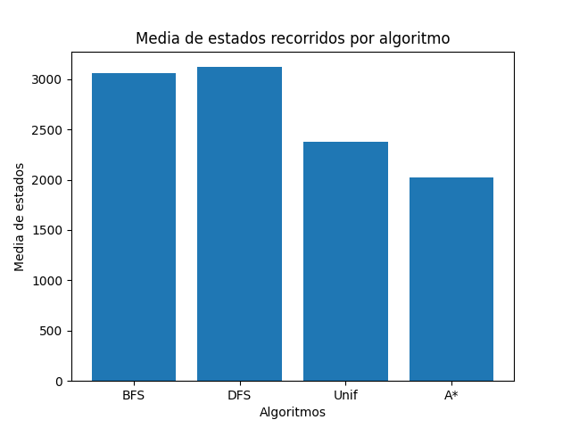

# Resultados TP4

## Valores tomados
### Pasos que recorrieron hasta la solucion : [2320, 1179, 160, 654, 253, 742, 6300, 6334, 3674, 55, 888, 997, 5680, 629, 2744, 485, 5, 2347, 382, 1681, 161, 834, 6223, 550, 1093, 3457, 3696, 2296, 3067, 1860]

### Media : 2024.8666666666666

### Desviacion estandar : 1978.5699770346735

### Comparativa con el tp3

